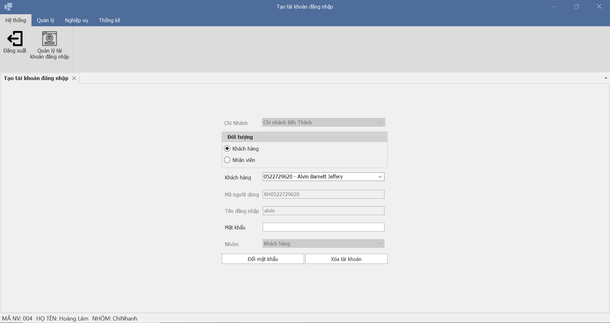
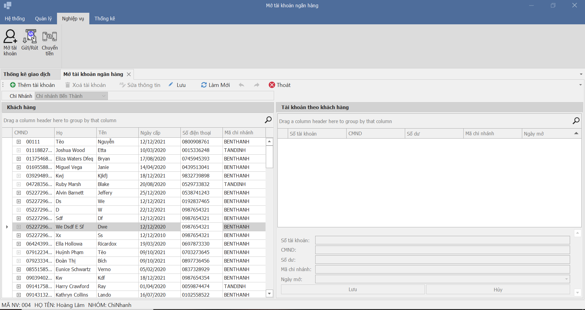
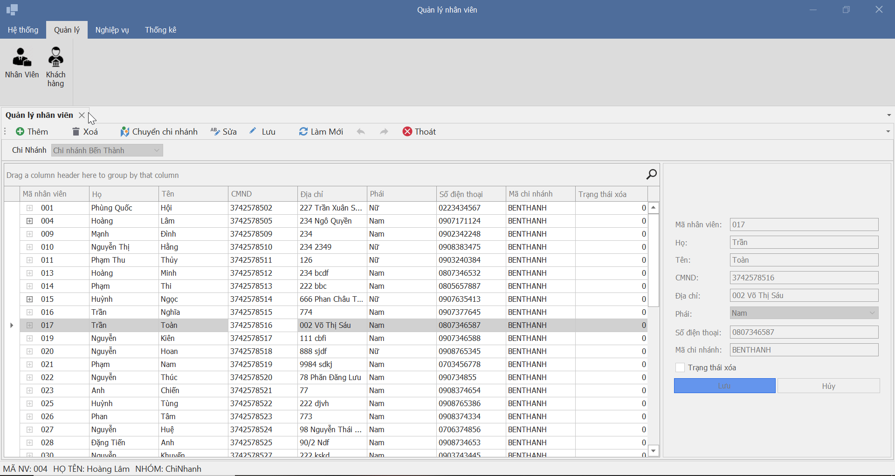
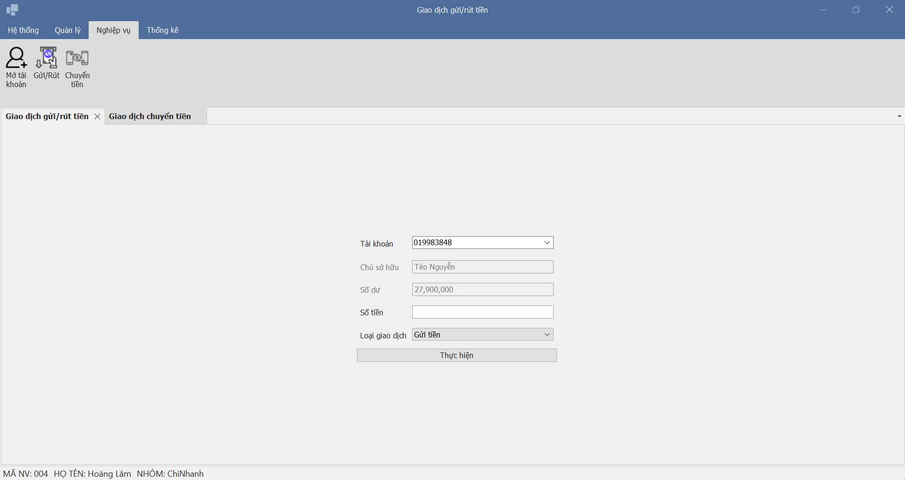

# Installation
- MS SQL Server Management Studio (SSMS)
- 4 server SQL with name: NGANHANG, NGANHANG1, NGANHANG2, NGANHANG3 with same database name NGANHANG. All setup for replication them in `script/` folder
- Service: Sql  Server Agent (avoid use sql server edtion express which missing this feature) and Microsoft Distribute Transaction Coordinator are runnings.
- Config file `scr/Settings.cs` (see sample file `src/Settings.example.cs`) for env variable
- Visual studio .NET and DevExpress for winforms compatible with version of visual studio
NOTE: Visual studio 2017 and DevExpress19.2.5 are used for create this project
# Features
- Soft delete
- Combine sql cursor and temporary view to calculate value share between record respectively
- Distribute transaction
- Parallel query with sql agent job
- Implement undo, redo feature via command pattern

# Acknowledgments
If you are working on this school project consider to read my notes in [wiki](https://github.com/trung-kieen/bank-replication/wiki).
