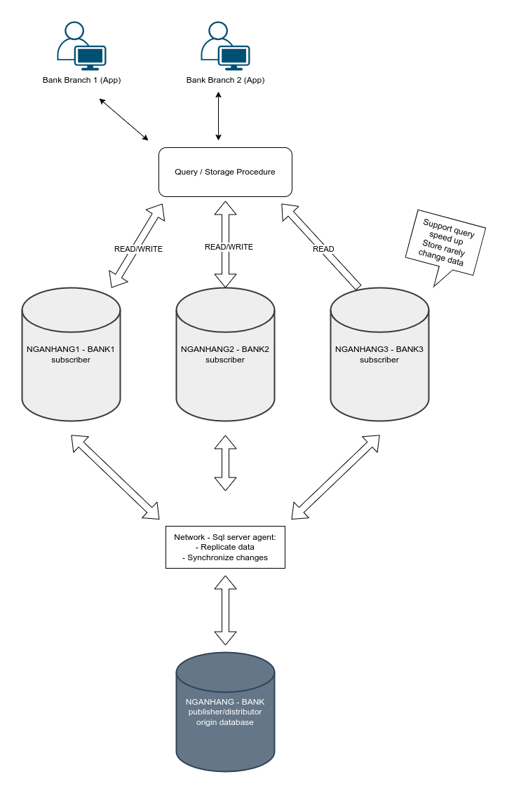
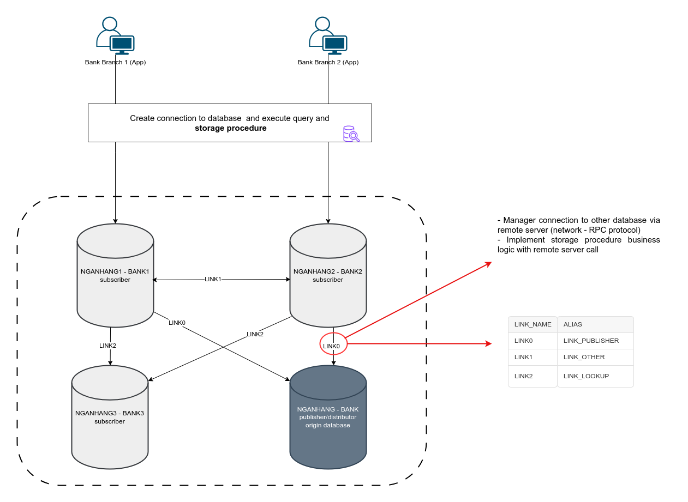

# Installation
- MS SQL Server Management Studio (SSMS)
- 4 server SQL with name: NGANHANG, NGANHANG1, NGANHANG2, NGANHANG3 with same database name NGANHANG. All setup for replication them in `scripts/` folder
- Service: Sql  Server Agent (avoid use sql server edtion express which missing this feature) and Microsoft Distribute Transaction Coordinator are runnings.
- Change sql login user `sa` and remote login password in `Program.cs` for appropriate with publisher database
- Visual studio .NET and DevExpress for winforms compatible with version of visual studio

NOTE: Visual studio 2017 and DevExpress 19.2.5 are used for create this project

# Archtechture 

# Features
- Distribute transaction
- Parallel query with sql agent job
- Implement undo, redo feature via command pattern

## Advantage 
- Database system able to scaling horizontally
- Speed up query when find data from smaller database. Especially when query for local database instead of remote database server
- Parallel query able to gather data from many database, speed up query execution by optimize many computer hardware
## Downside 
- Slow data synchronize of mssql server replication technology make different result from many aspect in a distribute transaction for a while. Data still inconsistency for a while even use distribute transaction level. (May be sql server still allow to query data those even it is in a distribute transaction?)
- Hard to manager connection to many database via network
- In this project there is no strategy to handle single point of failure
