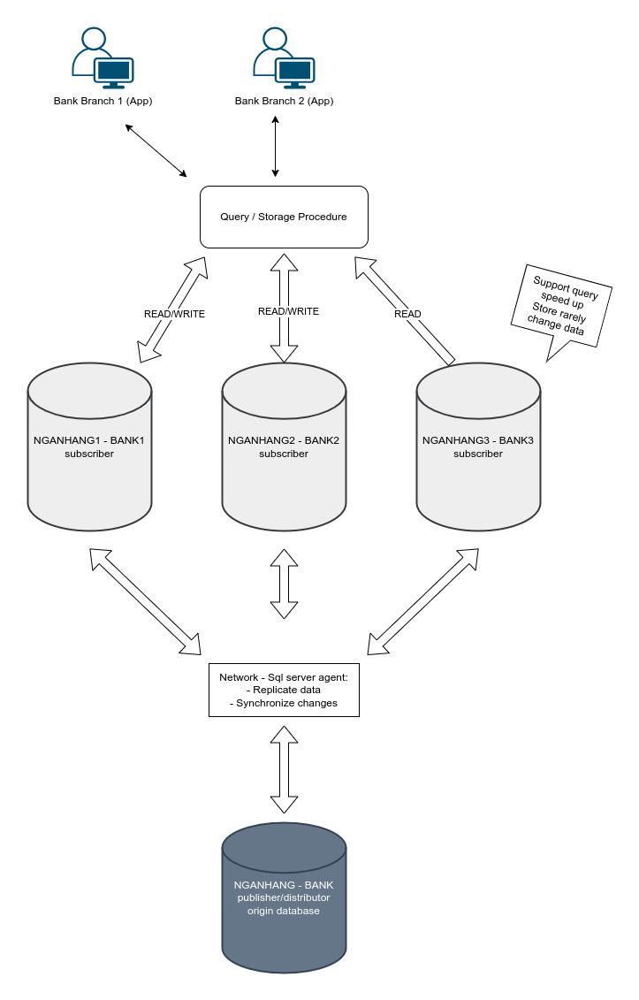
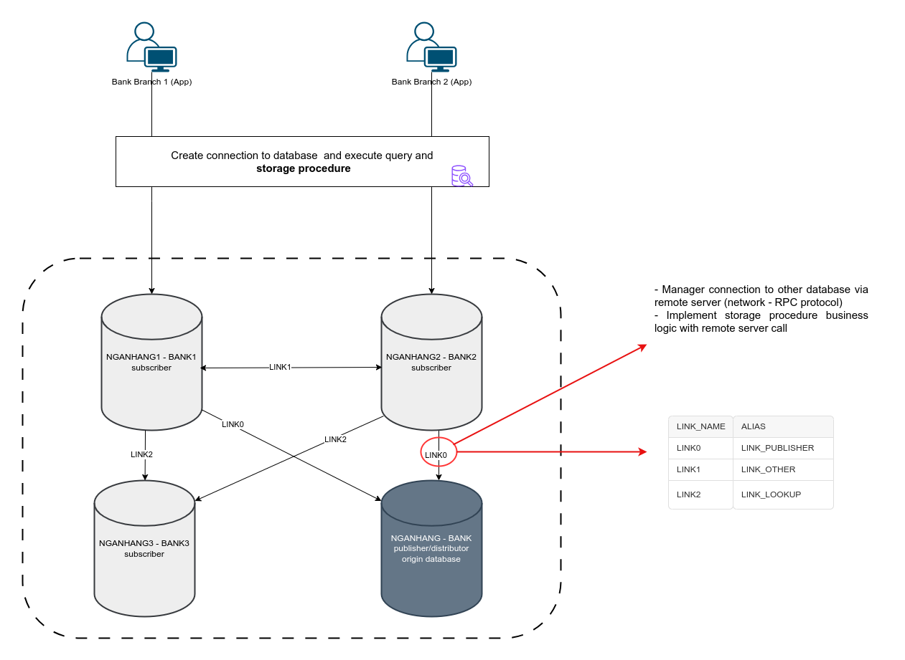
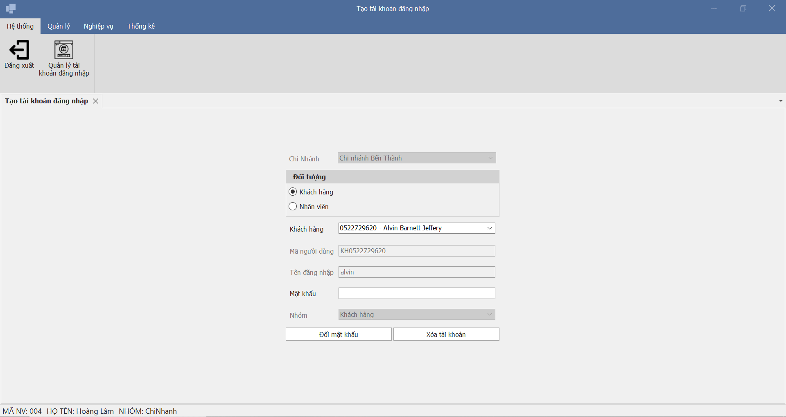
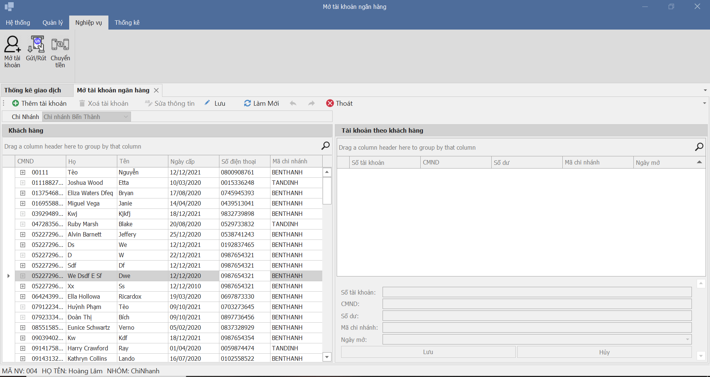
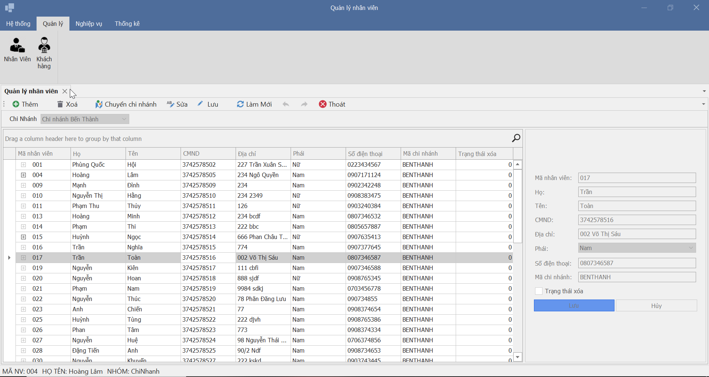
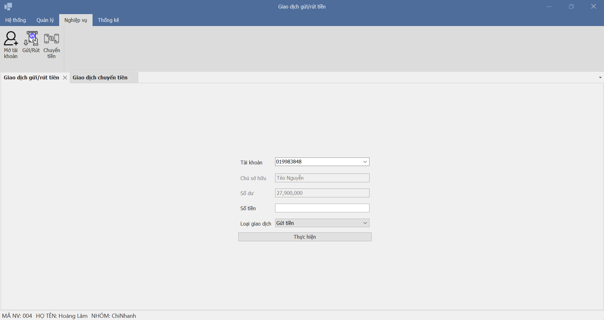

# What is this 
A simple desktop application working with database system replication over many sites
# Architecture
- Authentication and authorization: built on top of MS SQL Server login, user, server role, database role
- Database architecture: Two-Tier architecture
___

# Features
- Distribute transaction
- Parallel query with sql agent job
- Implement undo, redo feature via command pattern
___

## Advantage 
- Database system able to scaling horizontally
- Speed up query when find data from smaller database. Especially when query for local database instead of remote database server
- Parallel query able to gather data from many database, speed up query execution by optimize many computer hardware
## Downside  
- Slow data synchronize MS SQL server replication technology might allow different result from many aspect in a distribute transaction
- Hard to manager connection to many database via network
- In this project there is no strategy to handle single point of failure

# Installation

- MS SQL Server Management Studio (SSMS)
- 4 MS SQL Server with name: `NGANHANG`, `NGANHANG1`, `NGANHANG2`, `NGANHANG3` with same database name `NGANHANG`. All setup detail replication in `scripts/` folder (DDL script).
- Service: Sql Server Agent and Microsoft Distribute Transaction Coordinator to be enable
- Change sql login user `sa` and remote login password in `Program.cs` for appropriate with publisher database
- Visual studio .NET and DevExpress for winforms compatible with version of visual studio

Recommend: Visual studio 2017 developer edition and DevExpress 19.x 

# License

All code is licensed under an MIT license. This allows you to re-use the code freely, remixed in both commercial and non-commercial projects. The only requirement is to include the same license when distributing.
